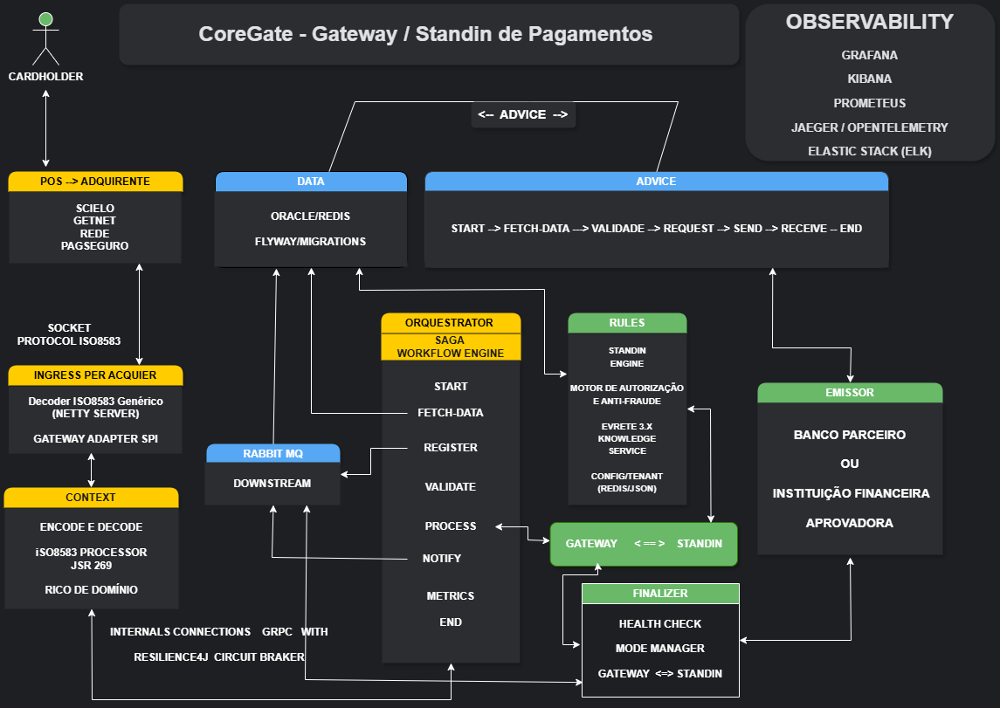
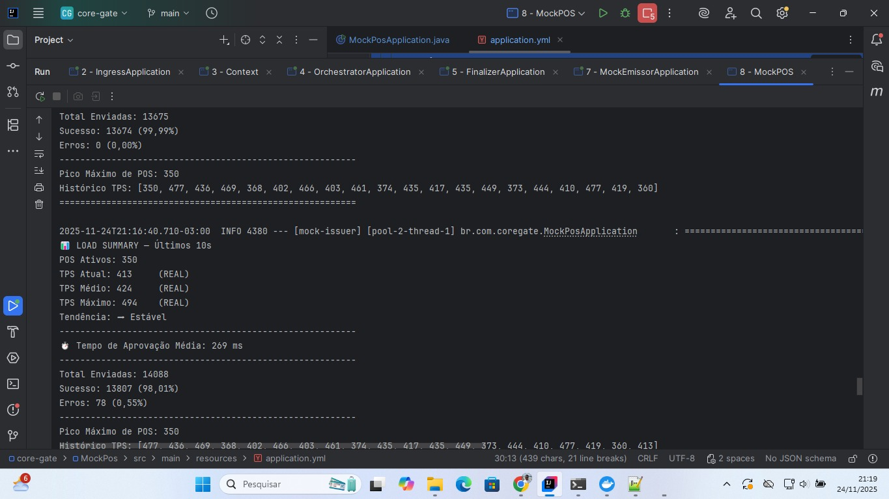

# CoreGate — Gateway / Stand-in Architecture

CoreGate é uma implementação completa de um **gateway transacional distribuído**, projetado para operar com **alto throughput, baixa latência e forte separação de responsabilidades**.

O projeto tem como foco **arquitetura de sistemas críticos**, explorando padrões consolidados de engenharia de software para processamento síncrono e assíncrono, com ênfase em **resiliência, orquestração explícita e observabilidade**.

---

## 🧭 Visão Arquitetural

A arquitetura do CoreGate segue um modelo **modular, orientado a eventos e orquestrado**, no qual cada etapa do fluxo transacional é explícita, isolada e observável.

### Princípios adotados

- Arquitetura **Hexagonal (Ports & Adapters)**
- **Saga Orchestration** explícita
- **CQRS** (separação de leitura e escrita)
- Programação **orientada a eventos**
- Isolamento entre entrada, decisão, execução e finalização
- Suporte a **stand-in mode** para continuidade operacional
- Contratos claros entre módulos

---

## 🧩 Módulos

O sistema é organizado em módulos independentes, cada um com responsabilidade única:

### `mock-pos`
Simulador concorrente de POS:
- geração de carga
- múltiplos terminais ativos
- controle de taxa e concorrência
- simulação realista de tráfego transacional

---

### `ingress`
Camada de entrada do sistema:
- conexão **Socket NIO**
- protocolo **ISO 8583**
- desacoplamento entre transporte e domínio
- gateway adapter via SPI

---

### `context`
Camada de domínio:
- encode/decode do protocolo
- **ISO 8583 Processor**
- geração de código em tempo de compilação via **JSR-269**
- abordagem semelhante ao Lombok para mapeamento de campos
- domínio rico e independente de infraestrutura

---

### `orchestrator`
Coração do fluxo transacional:
- **Saga / Workflow Engine**
- etapas explícitas:
    - fetch-data
    - register
    - validate
    - process
    - notify
    - metrics
- controle de idempotência
- isolamento de falhas por etapa

---

### `rules`
Camada de decisão:
- motor de regras baseado em **Evrete**
- regras declarativas e versionáveis
- decisões de autorização e antifraude
- suporte a **stand-in decision**
- configuração dinâmica (Redis / JSON)

---

### `advice`
Pipeline de execução síncrona:
- processamento determinístico
- validações encadeadas
- separação clara entre fluxo e decisão

Fluxo funcional:

START → FETCH → VALIDATE → REQUEST → SEND → RECEIVE → END

yaml
Copiar código

---

### `finalizer`
Camada de encerramento:
- health check
- mode manager (gateway ↔ stand-in)
- confirmação e fechamento transacional
- controle de estado final

---

### `data`
Persistência e estado:
- Oracle / Redis
- versionamento com Flyway
- controle de estado transacional
- leitura e escrita desacopladas do fluxo

---

### `mock-issuer`
Simulador de emissor:
- aprovação / negação determinística
- latência controlada
- utilizado para testes de fluxo e carga end-to-end

---

## 🔍 Observabilidade & Resiliência

Observabilidade é tratada como **requisito de primeira classe**:

- Prometheus
- Grafana
- Kibana
- Elastic Stack (ELK)
- Jaeger / OpenTelemetry

Resiliência:
- **Resilience4j** (circuit breaker)
- timeouts explícitos
- isolamento entre chamadas internas
- fallback controlado para stand-in

---

## 🔗 Comunicação Interna

- **gRPC** para comunicação entre módulos internos
- **RabbitMQ** para downstream assíncrono
- separação clara entre:
    - chamadas críticas síncronas
    - processamento eventual assíncrono

---

## ⚙️ Protocolo

- Implementação completa do **ISO 8583**
- decoder genérico
- processamento binário eficiente
- geração de código via **JSR-269**
- eliminação de reflexão em runtime
- foco em alto desempenho e baixo overhead

---

## 🚀 Desempenho

O fluxo foi testado **end-to-end**, do `mock-pos` até o `finalizer`, com aprovação retornada pelo `mock-issuer`.

### Evidência de carga

**Resultados observados:**

- TPS médio estável acima de 400
- **TPS máximo observado: 494**
- Latência média de aprovação: ~269 ms
- ~350 POS ativos simultaneamente
- Taxa de erro inferior a 1%

---

## 🧠 Princípios de Design

- Clareza acima de abstração excessiva
- Fluxos explícitos são preferíveis a “magia”
- Falhas são esperadas e tratadas
- Observabilidade não é opcional
- Contratos são mais importantes que implementações

---

## 📌 Considerações Finais

CoreGate materializa conceitos arquiteturais aplicáveis a sistemas distribuídos de missão crítica, com foco em:

- coordenação
- consistência
- resiliência
- desempenho
- auditabilidade

O projeto privilegia **arquitetura e engenharia** acima de frameworks ou tendências.